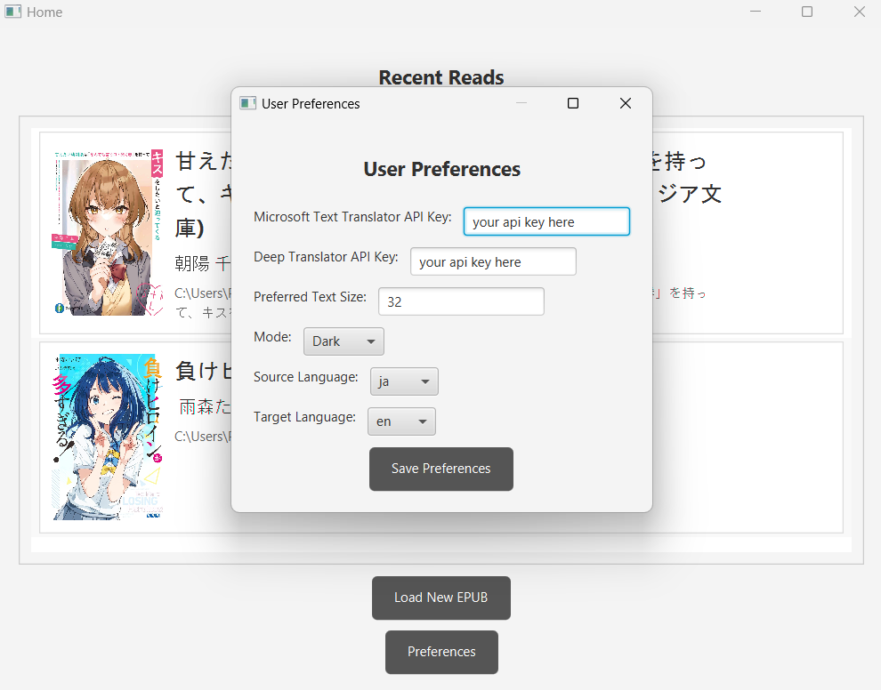
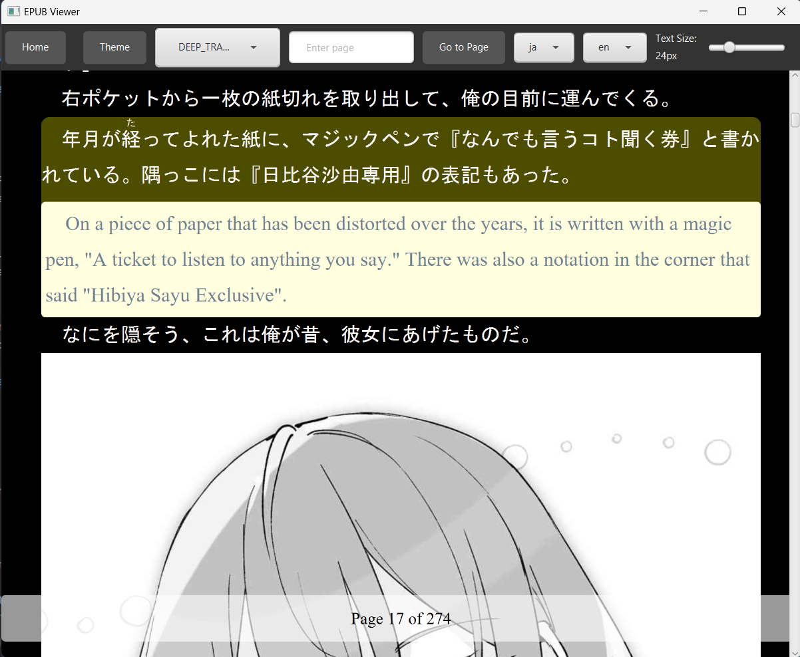

# EPUB Translator

EPUB Translator is a JavaFX application designed to facilitate the translation of EPUB files. The app allows users to load EPUB files, navigate through them, and translate text between different languages using various translation APIs.

## Features

- Load and display EPUB files
- Translate text between different languages
- Customize text size and theme
- Save user preferences for translation settings and API keys

## Installation

You can install and run the EPUB Translator using either the provided JAR file or the EXE file.

### Using the EXE File (Windows)

1. Download the latest release of the EPUB Translator from the [Releases](https://github.com/tranhuy105/epub-translator/releases) page.
2. Once downloaded, you can launch the EPUB Translator from your Start Menu or Desktop.

### Using the JAR File (Cross-platform)

1. Download the latest release of the EPUB Translator from the [Releases](https://github.com/tranhuy105/epub-translator/releases) page.
2. Ensure you have Java 17 or higher installed on your machine. You can download it from [here](https://adoptopenjdk.net/).
4. Run the application by double click the jar file or by using the following command:
    ```sh
    java -jar epub-translator-1.0.jar
    ```

### Manual Installation

If you prefer to build the project from the source, follow these steps:

1. Clone the repository:
    ```sh
    git clone https://github.com/tranhuy105/epub-translator.git
    ```
2. Navigate to the project directory:
    ```sh
    cd epub-translator
    ```
3. Ensure you have Maven installed. You can download it from [here](https://maven.apache.org/download.cgi).
4. Ensure you have Java 17 or higher installed on your machine. You can download it from [here](https://adoptopenjdk.net/).
5. Ensure you have the JavaFX SDK installed and configured. You can download it from [here](https://gluonhq.com/products/javafx/).
6. Build the project using Maven:
    ```sh
    mvn clean install
    ```
7. Run the application:
    ```sh
    java -jar target/epub-translator-1.0-SNAPSHOT.jar
    ```

## API Keys

EPUB Translator supports three translation APIs:

1. **MyMemory API** - Free to use.
2. **Microsoft Translator API** - Requires an API key, which you can obtain for free from [RapidAPI](https://rapidapi.com/).
3. **Deep Translate API** - Requires an API key, which you can obtain for free from [RapidAPI](https://rapidapi.com/).

### Obtaining API Keys

To use Microsoft Translator or Deep Translate, follow these steps to obtain your API key:

1. Go to [RapidAPI](https://rapidapi.com/) and create an account if you don't already have one.
2. Search for "Microsoft Translator" or "Deep Translate".
3. Subscribe to the API free tier and get your API key.

### Register API Keys

Once you have obtained your API keys, you need to register them in the user preferences on the home page of the EPUB Translator application:

1. Open the EPUB Translator application.
2. Go to the home page.
3. Click on the "Preferences" button.
4. Enter your API key for Microsoft Translator or Deep Translate in the respective fields.
5. Save your preferences.

    

## Usage

1. **Loading an EPUB file:**
    - Click on the "Load New EPUB" button to select and load an EPUB file.
    - The file will be displayed in the main view, allowing you to navigate through the pages.

2. **Navigating pages:**
    - Use the "Enter page" input field to go to a specific page.
    - The application also updates the page information as you scroll.

3. **Translating text:**
    - Select the source and target languages as well as translate models from the respective dropdown menus.
    - Click on any paragraph to translate the text. The translated text will be displayed below the original text.

    

4. **Adjusting text size:**
    - Use the text size slider to adjust the text size as per your preference.

5. **Switching themes:**
    - Toggle the theme using the "Theme" button to switch between light and dark modes.

## API Client Implementation

The application supports different translation APIs. But if you want to implement your own API client, you can do it easily by following these steps:

1. **Create a new API client class:**
    - Implement the `ApiClient` interface.

    ```java
    package com.tranhuy105.epubtranslator.models.client;

    import java.net.HttpURLConnection;
    import java.net.MalformedURLException;
    import java.net.URL;
    import java.io.IOException;

    public class MyCustomApiClient implements ApiClient {
        @Override
        public HttpURLConnection getHttpURLConnection(String originalText, URL url, String source, String target) throws IOException {
            // Your connection logic here
            return null; // Replace with actual connection logic
        }

        @Override
        public URL buildUrl(String originalText, String source, String target) throws MalformedURLException {
            // Your URL building logic here
            return null; // Replace with actual URL building logic
        }

        @Override
        public String parseResponse(String content) {
            // You need to extract the translated text from the response here
            return null; // Replace with actual response parsing logic
        }
    }
    ```

1. **Register your API client:**
    - Add your API client to the `ApiClientType` enum.

    ```java
    public enum ApiClientType {
        MY_MEMORY,
        MICROSOFT_TRANSLATOR,
        DEEP_TRANSLATE,
        MY_CUSTOM_API; // Add your custom API client here
    }
    ```

    - Register your client to the api client factory at `ApiClientService`.

    ```java
    public class ApiClientService() {
        public static ApiClient getClient(ApiClientType type) {
            return switch (type) {
                case MY_MEMORY -> new MyMemoryApiClient();
                case DEEP_TRANSLATE -> getDeepTranslatorApiClient();
                case MICROSOFT_TRANSLATOR -> getMicrosoftTranslatorClient();
                case MY_CUSTOM_API -> getMyCustomApi(); 
            };
        }
   
        public ApiClient getMyCustomApi() {
            // Implement your method here
            return null;
        }
        
        // other method
   }
    ```


## Contributing

Contributions are welcome! Please fork the repository and create a pull request with your changes!

## License

This project is licensed under the MIT License. See the [LICENSE](LICENSE) file for details.
